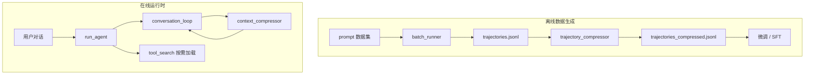
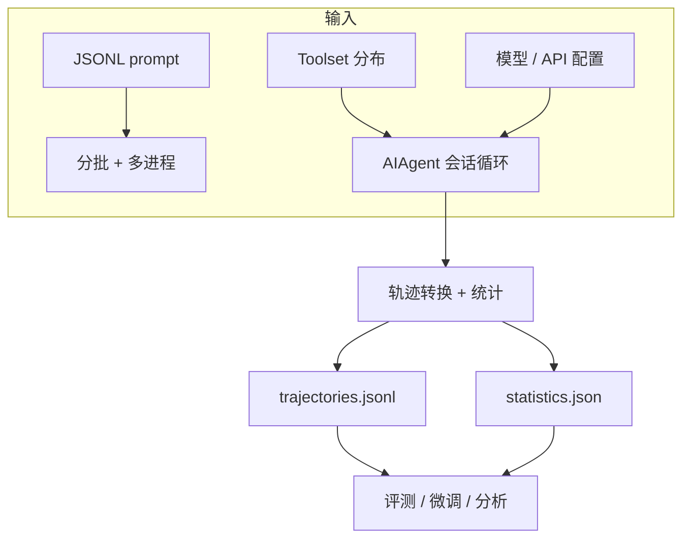
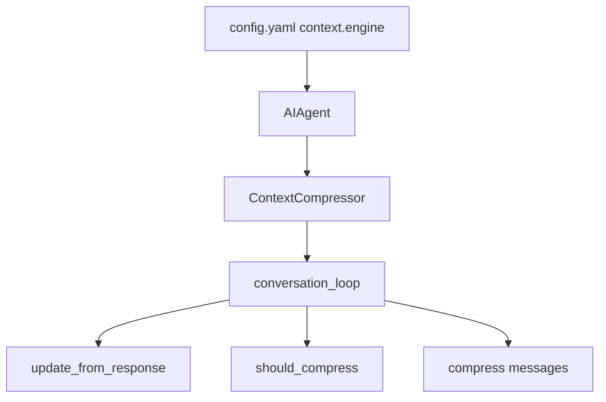

# Hermes Agent

**从模型到 Agent 到部署到自我改进，一条线全做了。**

---

## 概览

Hermes 有两条与「上下文长度」相关的流水线，外加工具按需加载与 SQLite 存储支撑：

| 路径 | 模块 | 时机 | 目的 |
| --- | --- | --- | --- |
| **离线 · 数据生成** | `batch_runner` → `trajectory_compressor` | batch 产出之后 | 轨迹 fit 训练窗口 |
| **在线 · 运行时** | `context_compressor` | 每轮对话中 | 会话不中断、防 context 溢出 |

| 模块 | 角色 | 典型场景 |
| --- | --- | --- |
| `run_agent.py` | 引擎 | 调试、日常一对一对话 |
| `batch_runner.py` | 生成器 | 批量产出 JSONL 轨迹 |
| `trajectory_compressor.py` | 精炼器（离线） | 压缩训练轨迹 |
| `context_compressor.py` | 内存管理器（在线） | 长对话压缩 + Session 续接 |
| `tool_search.py` | 按需加载器 | 工具集过大时渐进式披露 |
| SessionDB / WAL / FTS5 | 存储层 | Session 血缘、压缩锁、全文检索 |



**四件套关系**：

```
run_agent.py               → 引擎（怎么跑一条对话）
context_compressor.py      → 运行时内存管理（对话不中断 + Session 分裂）
batch_runner.py            → 生成器（批量产出轨迹）
trajectory_compressor.py   → 精炼器（轨迹 fit 训练窗口）
```

---

## batch_runner.py

**定位**：离线批量执行层——从「跑一条」到「跑一万条」可复现、可统计、可续跑的轨迹生成。

```
交互模式 (run_agent)          批量模式 (batch_runner)
─────────────────────        ─────────────────────────
人 ↔ Agent 实时对话            文件 → N 个 Agent → JSONL 轨迹
调试、日常使用                  训练数据 / 评测 / 基准测试
```

配置示例见 `hermes-agent/datagen-config-examples/`。`run_browser_tasks.sh` 典型用法：5 条浏览器任务、3 worker、最多 30 轮工具调用。

### 数据质量

批量模式按**训练数据标准**加工，而非简单存对话：

- **ShareGPT 格式**（`from` / `value`），兼容 HuggingFace 等下游
- `tool_stats` **schema 归一化**：所有工具都有字段，避免 schema 不一致
- **质量过滤**：无 reasoning 丢弃；幻觉工具名在合并时过滤
- **不污染轨迹**：`skip_memory=True`、`skip_context_files=True`，不把 SOUL.md 等写进轨迹

```json
{
  "prompt_index": 0,
  "conversations": [
    {"from": "human", "value": "用 Python 写一个函数，判断一个字符串是否为回文..."},
    {"from": "gpt", "value": "<think>...</think>\n<tool_call>{\"name\": \"terminal\", ...}</tool_call>"},
    {"from": "tool", "value": "<tool_response>...</tool_response>"},
    {"from": "gpt", "value": "def is_palindrome(s): ..."}
  ],
  "metadata": {"batch_num": 0, "model": "anthropic/claude-sonnet-4.6"},
  "completed": true,
  "tool_stats": {"terminal": {"count": 1, "success": 1, "failure": 0}}
}
```

### Toolset 分布

每条 prompt 从分布里**随机采样** toolset（`toolset_distributions.py`）：

```python
"browser_tasks": {"browser": 97, "web": 20, "vision": 12, ...}
```

`--distribution=browser_tasks` 即偏向 browser 的数据生成预设。

### 可靠性

| 机制 | 作用 |
| --- | --- |
| `checkpoint.json` | 每 batch 完成即写检查点 |
| `--resume` + **内容匹配** | 按 prompt 文本识别已完成项，顺序变了也能续跑 |
| `batch_*.jsonl` 分文件 | 单 batch 失败不影响其它 batch |
| 失败 prompt 不标记完成 | 恢复时自动重试 |



---

## trajectory_compressor.py

**定位**：离线后处理——把 `batch_runner` 产出的超长轨迹压到目标 token 预算内，供微调/SFT 使用。

| 组件 | 阶段 | 输入 | 输出 |
| --- | --- | --- | --- |
| `batch_runner` | 生成 | prompt 数据集 | 原始轨迹 |
| `trajectory_compressor` | 后处理 | 原始轨迹 | 压缩版轨迹 |

### 压缩算法

```
[system/human/首个 gpt+tool]  ← 保护头部
[gpt/tool ...]                ← 可压缩区（从第 2 个 tool 起，按需累积）
[gpt/tool/gpt]                ← 保护尾部（最后 N 轮 + 最终结论）

压缩后 → 中间段替换为 [CONTEXT SUMMARY] human 消息
```

### 六条策略

| # | 策略 | 说明 |
| --- | --- | --- |
| 1 | 保护头部 | system / human / 首个 gpt / 首个 tool |
| 2 | 保护尾部 | 最后 `protect_last_n_turns=4` 轮（默认） |
| 3 | 只压中间 | 从第 2 个 tool 响应之后开始 |
| 4 | 按需压缩 | 只压到 `target_max_tokens`，不过度压缩 |
| 5 | 摘要替换 | 被压区域 → `[CONTEXT SUMMARY]:` human 消息 |
| 6 | 边界对齐 | `_snap_boundary()` 避免 gpt↔tool 对之间切断 |

### 关键配置

| 参数 | 默认 | 含义 |
| --- | --- | --- |
| `target_max_tokens` | 15250 | 压缩后目标上限 |
| `summary_target_tokens` | 750 | 摘要目标长度 |
| `tokenizer_name` | Kimi-K2-Thinking | HF tokenizer 计 token |
| `summarization_model` | gemini-3-flash-preview | 廉价快模型做摘要 |
| `max_concurrent_requests` | 50 | 异步并发摘要 API 数 |

批量处理：`asyncio.gather` + `Semaphore(50)`，单条超时 300s，摘要失败用 fallback 文本降级。

### CLI

```bash
python trajectory_compressor.py --input=data/browser_tasks_example
python trajectory_compressor.py --input=data/demo_run/trajectories.jsonl \
  --output=data/demo_run/trajectories_compressed.jsonl --target_max_tokens=16000
python trajectory_compressor.py --input=data/trajectories.jsonl --sample_percent=15  # 试跑
python trajectory_compressor.py --input=data/my_run --dry_run
```

配置默认读 `configs/trajectory_compression.yaml`。

---

## context_compressor.py

**定位**：运行时上下文管理引擎——`run_conversation()` 循环里的「内存管理器」，token 接近窗口上限时自动压缩，会话不断。

| 维度 | 在线 `context_compressor` | 离线 `trajectory_compressor` |
| --- | --- | --- |
| 时机 | 每轮对话中 | batch 产出之后 |
| 对象 | OpenAI `messages[]` | ShareGPT JSONL |
| 触发 | token ≥ 50% context | token > `target_max_tokens` |
| 副作用 | Session 旋转 + DB 锁 | 无 |



### 核心设计

**分层处理**：工具裁剪（无 LLM）→ 边界划分 → LLM 摘要 → 组装清理

| 区域 | 策略 |
| --- | --- |
| 头 | system + 前几条（任务意图、工具定义） |
| 中 | LLM 摘要整段替换 |
| 尾 | 按 token 预算保留最近上下文（阈值的 20%，200K 模型 ≈ 20K） |

**Cheap 技巧**：单行摘要 terminal 输出、tool 去重、大 JSON 参数截断、旧截图/base64 剥离。

**结构化摘要模板**：

| 章节 | 含义 |
| --- | --- |
| Goal | 项目要干什么（北极星） |
| Progress | 已做什么、卡在哪 |
| Files | 动过哪些文件/资源 |
| Remaining Work | 还差什么（背景，不是命令） |

**防误读**：前缀 `[CONTEXT COMPACTION — REFERENCE ONLY]`；用 Remaining Work 而非 Next Steps；摘要后加 `--- END OF CONTEXT SUMMARY ---`。

**防抖动**：连续 2 次压缩节省 <10% 停自动压；preflight defer；`/compress` 可 force 重试。

**失败降级**：LLM 摘要 → 静态 fallback → 可选 `abort_on_summary_failure=true` 冻结等 `/new`。

### Session 分裂

压缩成功（非 abort）后，DB 层旋转到新 session：


| | 压缩续接 | `/branch` |
| --- | --- | --- |
| 父 session | 已结束 | 可并行存在 |
| 关系 | 单链延续 | 并行探索 |

**不分裂**：压缩 abort、锁冲突、无 SessionDB。

### 压缩锁（跨进程）

```
想压缩 → DB 登记「此 session 正在压缩」→ 成功才继续 → 整段旋转完才释放
```

| 选择 | 原因 |
| --- | --- |
| SQLite 表锁 | CLI / Gateway / 后台跨进程，内存锁不够 |
| `session_id` 主键 | 同一 session 只能一把锁 |
| `INSERT OR IGNORE` | 原子抢锁 |
| 过期 5 分钟 | 防进程崩溃死锁 |

**fail closed**：抢不到锁 → 不压、不 fork orphan session，下轮再试。

---

## SessionDB 与存储

Session 血缘、压缩锁、credential 等组件共用 SQLite。两个关键扩展：

### SQLite WAL 模式

WAL（Write-Ahead Logging）让读写分离，实现「Readers don't block writers and writers don't block readers」。

| 对比项 | 传统 DELETE 日志（靠锁） | WAL 模式 |
| --- | --- | --- |
| 读 | 读主文件 | 读主文件 + WAL 日志 |
| 写 | 直接改主文件，加锁 | 只追加 WAL，不碰主文件 |
| 并发 | 一写阻塞多读 | 多读 + 一写可并行 |

**Checkpoint**：WAL 定期合并回主库。策略如「每 50 次写入 PASSIVE checkpoint」——有读在进行时不强行阻塞，平衡 WAL 大小与性能。

### FTS5 全文检索

FTS5 是 SQLite 全文搜索虚拟表，用**倒排索引**替代 `LIKE '%keyword%'` 全表扫描：

```sql
CREATE VIRTUAL TABLE email USING fts5(sender, title, body);
```

事先把文本拆成 token 并建词汇表，搜索时直接查索引定位文档，适合 Session 消息、记忆等文本检索场景。

---

## 工具系统

**核心思路**：**渐进式披露（Progressive Disclosure）**——不一次性暴露所有工具，需要时再加载。

`tool_search.py` = 工具太多时的「搜索引擎 + 按需加载器」：MCP/插件工具暂时藏起来，换成 3 个桥接工具；模型需要时再搜、再查、再调，节省上下文。

```
用户发消息 → run_agent 对话循环
    → model_tools.get_tool_definitions()
    → tool_search.assemble_tool_defs()（决定是否藏起来）
    → 模型看到桥接工具 + 核心工具
    → 模型调用 tool_search / tool_describe / tool_call
    → handle_function_call() 桥接分发 → registry → 具体 handler
```

### 五层架构

```
┌─────────────────────────────────────────────────────────┐
│  入口层   run_agent / cli / gateway / batch_runner       │
├─────────────────────────────────────────────────────────┤
│  编排层   model_tools.py（对外 API + 缓存 + 分发）       │
├─────────────────────────────────────────────────────────┤
│  分组层   toolsets.py（套餐 / 组合 / 核心清单）          │
├─────────────────────────────────────────────────────────┤
│  注册层   tools/registry.py（登记 / 查表 / dispatch）    │
├─────────────────────────────────────────────────────────┤
│  实现层   tools/*.py（自注册 handler + schema）          │
└─────────────────────────────────────────────────────────┘
         ↑ 横切：tool_search（按需加载）、plugins hooks / middleware
```

**原则**：注册与执行分离、分组与实现分离、编排与业务分离。

| 模块 | 单一职责 |
| --- | --- |
| `tools/*.py` | 能做什么 |
| `registry.py` | 谁注册了、能不能用 |
| `toolsets.py` | 哪些工具组成一个场景 |
| `model_tools.py` | 组装列表 + 统一分发 |
| `run_agent` + `tool_executor` | 对话循环里怎么调、怎么并行 |

### 十大设计模式

| # | 模式 | 要点 |
| --- | --- | --- |
| 1 | 自注册 Plugin | 各工具文件 import 时 `registry.register()`；AST 静态扫描找注册点，避免 eager import 循环依赖 |
| 2 | Facade + Forwarder | `run_agent` 转发到 `agent/` 子模块，保留 patch 点；子模块 `_ra()` 懒 import |
| 3 | Toolset 套餐 | `"research": {"includes": ["web", "vision"]}`；核心工具永远可见；`disabled_toolsets` 做减法 |
| 4 | 单一 Dispatch | 所有调用过 `handle_function_call()`：bridge 解包 → middleware → hook → approval → dispatch |
| 5 | Tool Search | `tool_search → tool_describe → tool_call`；无状态目录每轮重建；auto 模式 deferrable ≥ 10% 上下文才激活 |
| 6 | 双层执行 | 批次级：安全则 ThreadPoolExecutor（≤8）；Handler 级：sync 直接跑，async 用 `_run_async()` |
| 7 | Agent 级 vs Registry 级 | `todo`/`memory`/`delegate_task` 需 Agent 状态，在 `invoke_tool()` 注入 |
| 8 | 可用性门控 | `check_fn` + 30s TTL；MCP refresh bump `_generation` 使缓存失效 |
| 9 | 三层结果预算 | ① 工具自截断 ② 超大单结果 spill 到 sandbox ③ 单轮合计超 200K spill 最大项 |
| 10 | Schema Sanitizer | 发给模型前 deep copy + sanitize，修复 llama.cpp / MCP 不支持的 JSON Schema |

**并行白名单**：`read_file`、`web_search` 等只读可并行；文件类需路径不重叠；`clarify` 等交互工具永不并行。

### 安全体系（纵深防御）

| 层级 | 机制 | 位置 |
| --- | --- | --- |
| 权限 | toolset 白名单 / disabled 减法 | model_tools |
| 范围 | Tool Search session scope | tool_search |
| 拦截 | pre_tool_call 插件 block | plugins |
| 循环 | Tool Guardrails | agent/tool_guardrails.py |
| 审批 | 危险 terminal / ACP 编辑 | approval.py |
| 路径 | validate_within_dir 防穿越 | path_security.py |
| 并发 | 路径重叠检测 | tool_dispatch_helpers.py |
| 中断 | 按 thread_id 信号 | tools/interrupt.py |
| 沙箱 | execute_code 子进程 + 白名单 | code_execution_tool.py |

关键：`HERMES_YOLO_MODE` import 时冻结；approval session key 用 ContextVar；同名工具默认拒绝 shadow。

### 同步 / 异步模型

| 层级 | 策略 |
| --- | --- |
| 对话主循环 | 同步（等工具完成再继续） |
| `handle_function_call` | 同步 API（返回 str） |
| 多 tool_calls | ThreadPoolExecutor 并行（非 asyncio 协程） |

`_run_async()` 三路径：CLI 主线程持久 loop / worker 线程 thread-local loop / Gateway 新线程独立 loop（300s 超时）。不用 `asyncio.run()` 反复创建/销毁 loop。

### 扩展机制

| 扩展点 | 用途 |
| --- | --- |
| `registry.register(override=True)` | 插件替换内置 |
| MCP deregister + register | 动态刷新工具列表 |
| plugins hooks | pre/post tool_call |
| middleware | 改写请求/执行参数 |
| `dynamic_schema_overrides` | 运行时更新 schema |
| `check_fn` + `requires_env` | 条件可用 + doctor 诊断 |

### 生产级工程技巧

- **启动**：OpenAI SDK、fire、MCP discovery 懒加载；`get_tool_definitions` LRU 缓存（8 条）+ generation 失效
- **测试**：re-export 保持 `patch("run_agent.X")` 契约；registry / guardrails 纯函数化
- **容错**：`assemble_tool_defs` 失败跳过 Tool Search；handler 异常 → JSON error；配置 typo 回退默认
- **可观测**：post_tool_call 带 duration_ms；trajectory 保存时 unwrap bridge、strip base64
- **并发**：Registry RLock + snapshot；Gateway 多 Agent interrupt 按 thread_id；并行结果按原始顺序 append

### 数据流

```
config.yaml → get_tool_definitions → resolve_toolset → registry.get_definitions
  → schema_sanitizer → assemble_tool_defs → AIAgent.tools → 模型 API
  → tool_calls → _execute_tool_calls → handle_function_call → registry.dispatch
  → maybe_persist + enforce_turn_budget → append tool message → 下一轮
```

### 框架对比与最小可行设计

| 维度 | Hermes 取向 |
| --- | --- |
| 工具发现 | 文件级自注册 + AST 扫描 |
| 工具暴露 | Toolset 套餐 + 可选 Tool Search |
| 安全 | 多层审批 + 路径校验 + 循环检测 |
| 状态 | Fat Agent 持有 todo/memory/session |
| 扩展 | 插件 hook + middleware，不改核心 dispatch |

**最值得借鉴的四件套**：Registry 自注册 + 单一 dispatch + check_fn 门控 + 结果 spill 到文件。

**一句话**：自注册 Registry + Toolset 套餐 + 单一 Dispatch + 多层安全 + 可选 Tool Search + 三级结果预算——用 Facade 稳定 API、懒加载保性能、默认保守保安全。

---

## 完整 Demo 流程

```bash
# Step 1: batch_runner 生成原始轨迹
python batch_runner.py \
  --dataset_file=datagen-config-examples/example_browser_tasks.jsonl \
  --batch_size=2 --run_name=browser_demo --num_workers=2

# Step 2: 压缩到训练可用长度
python trajectory_compressor.py \
  --input=data/browser_demo/trajectories.jsonl \
  --target_max_tokens=16000
# → data/browser_demo/trajectories_compressed.jsonl
```

压缩前后：`45000 tokens / 28 turns` → `14800 tokens / 10 turns`（中间段变 `[CONTEXT SUMMARY]` human 消息）。

---

## 设计取舍

| 选择 | 原因 |
| --- | --- |
| 保护头尾、只压中间 | 任务意图 + 最终结论最重要 |
| 用廉价模型做摘要 | 大批量处理，成本敏感 |
| Kimi tokenizer 计 token | 对齐目标训练模型 |
| 按需压缩而非全压 | 已在 budget 内原样保留 |
| 在线/离线 compressor 分离 | messages vs ShareGPT，职责清晰 |
| Session 旋转 + SQLite 锁 | 分段存储，fail closed 防 orphan |
| Tool Search 按需加载 | 大工具集省 context，小工具集零开销 |
| 单一 Dispatch + 多层安全 | hook/审批/日志一处，默认保守 |

---

## 总结

| 维度 | 说明 |
| --- | --- |
| 离线流水线 | `batch_runner` → `trajectory_compressor` → 微调/SFT |
| 在线流水线 | `run_agent` + `context_compressor` + Session 续接 |
| 工具系统 | Registry + Toolset + Dispatch + Tool Search + 三级预算 |
| 存储 | SQLite WAL 高并发 + FTS5 全文检索 |
| 核心能力 | token 管理 + 智能压缩 + 按需工具加载 + 纵深安全 |
| 不在职责内 | 模型训练本身、Gateway 传输层 |
