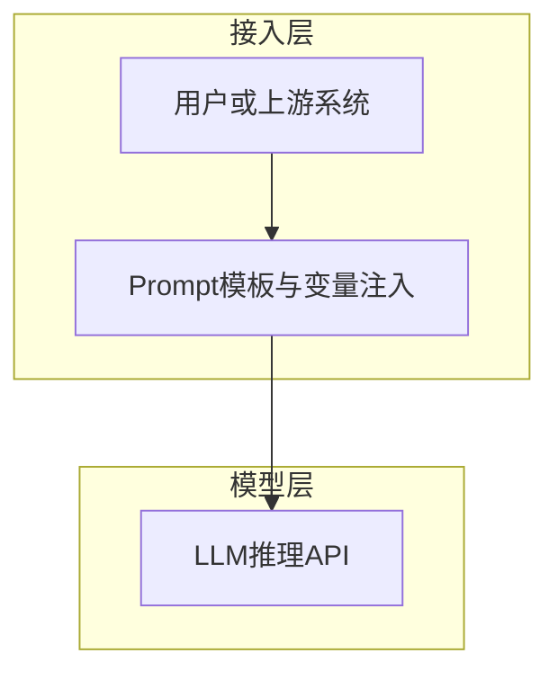
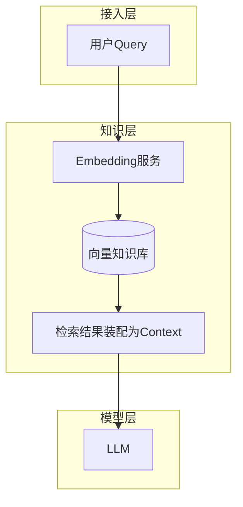
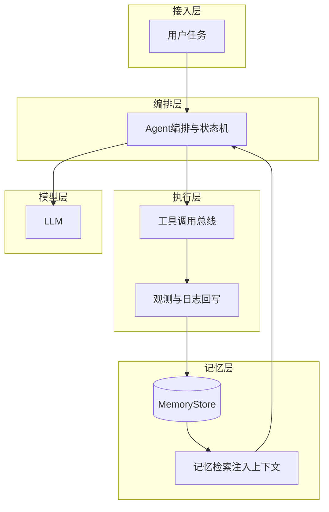
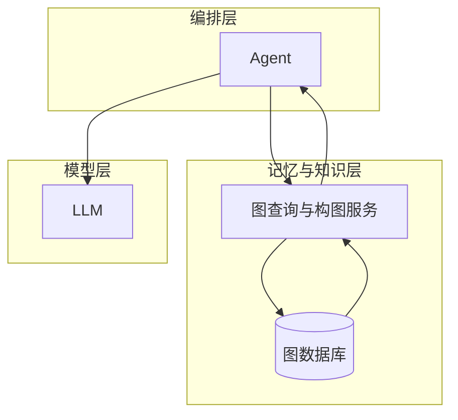
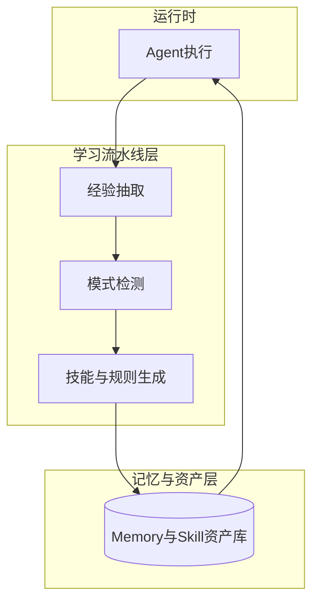
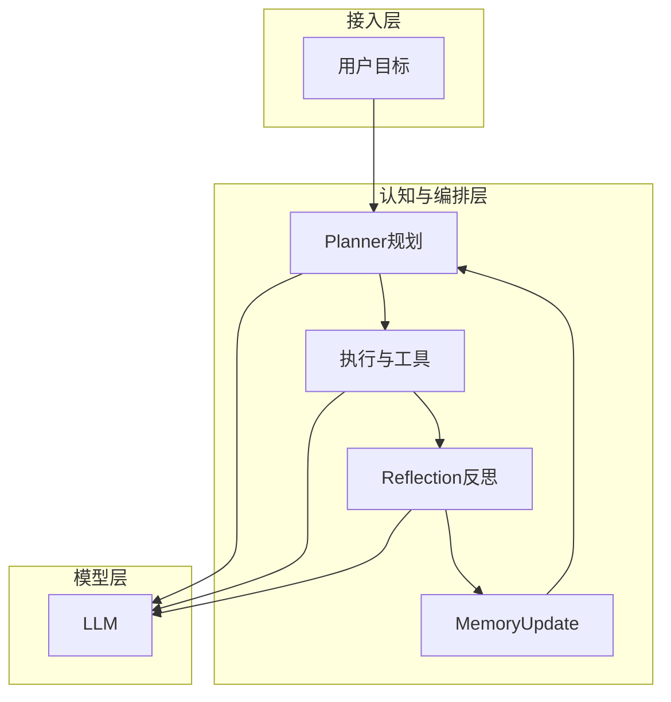

# GPT-1 → InstructGPT 与 RLHF（团队技术分析·简版）

**主线**：自回归语言建模（预训练 + 扩规模）→ 基座会续写但不对齐 → **RLHF** 用人类偏好把输出拉到「有用、诚实、无害」。

## 语言模型建模（技术前提）

- **对象**：文本是 token 序列 $x_1,\ldots,x_T$（字/子词/BPE 等，工程上统一叫 token）。
- **自回归分解**（链式法则）：联合分布写成每一步「只看过去」的条件概率连乘，**不引入 HMM 式隐状态**；直接对可见序列建模。

$$
P(x_1,\ldots,x_T)=\prod_{t=1}^{T}P(x_t\mid x_{<t})
$$

- **神经语言模型**：用网络（RNN/Transformer 等）根据前缀 $x_{<t}$ 产出 logits，经 **softmax** 得到 $P_\theta(x_t\mid x_{<t})$；训练目标通常是整句对数似然（或平均到每个 token）。
- **生成**：自回归采样或贪心/束搜索，逐 token 条件于已生成前缀；**上下文窗口**在实现上限制「能看到的过去」长度，属工程截断，与 HMM 假设不是一回事。

---

## 1. GPT-1（2018）

- **创新**：Transformer **解码器** + **预训练**（下一词预测）+ **任务微调**；验证「先通用语料、再少量标注任务」有效。
- **核心目标**（预训练阶段）：

$$
\max_{\theta}\ \sum_{t}\log P_{\theta}(w_t \mid w_{<t})
$$

- **Demo**：像学生 **先泛读再按题型微调**——比从零只刷小题更省标注、泛化更好。

---

## 2. GPT-2（2019）

- **要点**：更大规模自回归 LM；**任务只靠 prompt 描述**，同一 $\theta$ 做多任务，**推理不更新权重**（与 GPT-1 任务微调对照）。
- **机制**：全是 $P_\theta(x_t\mid x_{<t})$，前缀 = 指令 +（可选）$k$ 条「输入→输出」范例 + 当前待做输入；模型 **续写** 当作答案。

---

## 3. GPT-3（2020）

- **要点**：与 GPT-2 **同一套 zero / one / few 提示机制**，靠 **规模** 把 **in-context learning** 做实：更易从范例里抄格式、抄映射。
- **约束**：范例占 token，**$k$ 受上下文长度限制**；基座仍是 **互联网续写器**，易跑题、指令不稳、有害与幻觉——与「会不会 few-shot」不是一回事。

### 翻译 Demo：Zero-shot / One-shot / Few-shot

（经典英译法示意；竖线 `|` 仅区分「模型应续写」位置，实际写作一段连续 prompt。）

**Zero-shot（$k=0$，无范例）**——只交代任务 + 给待译词，模型靠预训练里见过的「翻译腔」蒙：

```
Translate English to French:
cheese |
```

**One-shot（$k=1$，一条范例）**——多一行对齐关系，模型更容易进入「A 译成 B」的模式：

```
Translate English to French:
sea otter | loutre de mer
cheese |
```

**Few-shot（$k\ge 2$，多条范例）**——模式重复加强，通常比 0-shot/1-shot 更稳（仍受窗口与噪声影响）：

```
Translate English to French:
sea otter | loutre de mer
plush giraffe | girafe peluche
cheese |
```

- **对照记忆**：范例数 **0 / 1 / $k$** → **zero-shot / one-shot / few-shot**；**无梯度步**，仅靠 attention 读前缀。

---

## 4. InstructGPT（≈2022，Ouyang et al.）

- **创新**：在 GPT-3 类基座上 **SFT + 奖励模型 RM + PPO（+ KL 约束）**，把行为对齐到人类偏好（与 ChatGPT 路线同精神）。
- **总思路公式化**（直觉）：在不要太偏离参考模型 $\pi_{\mathrm{ref}}$（常用 SFT 模型）的前提下，提高 RM 打分。

$$
\max_{\theta}\ \mathbb{E}_{x\sim\mathcal{D},\,y\sim\pi_\theta(\cdot\mid x)}\big[r_\phi(x,y)-\beta\,\mathrm{KL}(\pi_\theta(\cdot\mid x)\,\|\,\pi_{\mathrm{ref}}(\cdot\mid x))\big]
$$

- **Demo**：从 **会写作文** 到 **按题目、简短、不杠、不乱编**——产品可用性台阶。

---

## 5. RLHF 三步（对齐在干什么）

| 步            | 作用                                                                | 通俗 Demo（同一道题）                                                       |
| ------------- | ------------------------------------------------------------------- | --------------------------------------------------------------------------- |
| **SFT** | 用人工写的 `(指令, 理想回答)` 做监督，得到听话的初版策略          | 老师给**标准答案**；学生照抄改写到像样。                              |
| **RM**  | 人类对多个回答**排序**，训练 $r_\phi(x,y)$ 预测「哪个更好」 | 两篇作文**只比高低**；比多了就有个 **自动裁判** 先筛一轮。      |
| **PPO** | 把 LM 当策略，按 RM 奖励更新 token 级决策，**KL** 拉住别崩    | **多拿裁判分**，但不能 **写成另一个人** 或 **尬舔刷分**。 |

**对齐相对基座多解决啥**：指令遵循、毒性降低、更贴用户意图（幻觉仍要工程与评测长期盯）。

---

## 6. PPO 裁剪目标（核心式 + 含义）

**概率比** + **优势** $\hat{A}_t$ + **clip** 限制一步更新幅度：

$$
L^{\mathrm{CLIP}}(\theta)=\mathbb{E}_t\left[\min\left(r_t(\theta)\hat{A}_t,\ \mathrm{clip}\big(r_t(\theta),1-\varepsilon,1+\varepsilon\big)\hat{A}_t\right)\right]
$$

$$
r_t(\theta)=\frac{\pi_\theta(a_t\mid s_t)}{\pi_{\theta_{\mathrm{old}}}(a_t\mid s_t)}
$$

- $r_t$：新/旧策略对 **同一 token（动作）** 的概率比。
- $\hat{A}_t$：**这一步比平均水平好多少**（往高分方向推策略）。
- `clip` + `min`：**别一步迈太大**，训练稳定。

---

## 7. LLM 典型训练与偏好对齐（DPO 等）

### 7.1 训练阶段（团队口径）

| 阶段                   | 数据 / 目标                                                                    | 作用                                                            |
| ---------------------- | ------------------------------------------------------------------------------ | --------------------------------------------------------------- |
| **预训练 PT**    | 大规模语料，下一 token 似然                                                    | 语言能力、世界知识（统计层面）                                  |
| **监督微调 SFT** | 指令–回答、对话等高质量示范                                                   | 会「照着人写」、格式与任务形态                                  |
| **偏好对齐**     | 人类/AI 对**$(y_{\mathrm{win}}\succ y_{\mathrm{lose}}\mid x)$** 等信号 | 从「像语料」拉到**有用、安全、诚实**；可与 SFT 交错或分步 |

- **RLHF**：对齐 = **RM + PPO（+ KL）**（见第 4～6 节）：显式奖励模型 + 在线采样更新，**链路长、调参重**。
- **直接偏好优化**：在 **同一批偏好数据** 上 **直接更新策略** \(\pi_\theta\)，常 **省掉 RM 与 PPO 回路**；落地以 **DPO** 最常见。口语里的 **「DRPO」多为 DPO 笔误**（Direct Preference Optimization）。

### 7.2 DPO（Direct Preference Optimization）在优化什么

- **输入数据**：提示 $x$，人类更偏好回答 $y_w$（win）劣于 $y_l$（lose）；冻结参考策略 \(\pi_{\mathrm{ref}}\)（常为 SFT 模型）。
- **思想**：把「隐式奖励」写成 \(\pi_\theta\) 与 \(\pi_{\mathrm{ref}}\) 的 **对数似然差**，用 **Bradley–Terry 式** 损失直接拉大 \(y_w\) 相对 \(y_l\) 的 margin，同时用 \(\pi_{\mathrm{ref}}\) **隐式控 KL**，避免为刷偏好而崩分布。
- **典型目标**（只记形状即可；$\sigma$ 为 sigmoid，$\beta$ 控强度）：

$$
\mathcal{L}_{\mathrm{DPO}}(\theta)=-\mathbb{E}_{(x,y_w,y_l)\sim\mathcal{D}}\left[\log\sigma\left(\beta\Big(\log\frac{\pi_\theta(y_w\mid x)}{\pi_{\mathrm{ref}}(y_w\mid x)}-\log\frac{\pi_\theta(y_l\mid x)}{\pi_{\mathrm{ref}}(y_l\mid x)}\Big)\right)\right]
$$

- **相对 RLHF**：实现简单、**离线**偏好对即可训、无 PPO 采样环；难点在 **数据质量**、与 **SFT/长上下文** 的配合及 **过拟合 ref** 等，工程上仍有超参 \(\beta\) 与数据配比要扫。

### 7.3 其它常见「DPO 系」叫法（极简）

- **IPO / cDPO**：缓解 DPO 在噪声偏好或过强优化下的不稳，改损失形式或约束。
- **ORPO**：在 SFT 同期加偏好项，**少一段单独 SFT+对齐** 的流程变体（依实现而定）。
- **KTO**：不强制成对，用 **单条**「好/坏」标签也能对齐。
- **RLAIF**：用 **模型**（经规则/人校）代替部分人标偏好，再接 RLHF 或 DPO 类损失。

---

## 8. LLM 推理概览（含 KV Cache）

### 8.1 自回归推理在干什么

- **输入**：提示（prompt）经分词为 token 序列；**输出**：从左到右逐个生成 token，每步把上一步输出再喂回模型，直到 EOS 或达到 `max_new_tokens`。
- **与训练的区别**：推理时 **不反传**；关心 **延迟、吞吐、显存/内存**，尤其是 **长上下文 + 多并发** 时的 **KV 占用**。

### 8.2 两阶段：Prefill 与 Decode（解码）

| 阶段                      | 在算什么                                                                              | 特点                                          |
| ------------------------- | ------------------------------------------------------------------------------------- | --------------------------------------------- |
| **Prefill（预填）** | 对**整段 prompt** 做一次（或按块）前向，得到 **第一个** 续写 token 的分布 | 可并行算 prompt 内各位置，算力密集            |
| **Decode（解码）**  | 每步只多**1 个新 token**，在其位置上算注意力并采样/贪心出下一个                 | 显存与**历史长度** 强相关，内存带宽敏感 |

直觉：**先一口气读完题目（prefill），再一个字一个字写答案（decode）**。

### 8.3 若没有 KV Cache 会怎样

- 生成第 $t$ 个新 token 时，自注意力要对 **长度为「prompt + 已生成前缀」** 的全序列算 **Query / Key / Value**。
- **朴素重算**：每一步都把 **所有历史位置** 的 K、V **从头再算一遍** → 随序列变长，**时间近似按长度平方爆**（反复扫历史），工程上不可接受。

### 8.4 KV Cache 是什么

- **做法**：在 **每一层**、对 **已经算过的每个 token 位置**，把该层的 **Key、Value**（或经 GQA/MQA 压缩后的 KV）**存进缓存**；decode 的 **新一步** 只为 **当前新 token** 算 Q、K、V，其中 **K、V 追加进 cache**，**Q 与 cache 里所有历史 K 做注意力**。
- **效果**：历史位置的 K、V **只算一次**，后续步 **只增量更新**，decode 每步代价相对序列长度近似 **线性**，而不是每步重算整段。
- **形状直觉**（单层、简化）：缓存可看成按 token 维堆叠；总显存与 **层数 × 序列长度 × KV 头数 × 头维 × 精度字节数** 同阶（具体因 **MHA / GQA / MQA** 而异）。

### 8.5 代价与常见优化（团队听个名）

- **瓶颈**：KV cache 随 **batch × 序列长** 涨显存；长上下文服务要算 **能撑多少并发**。
- **GQA / MQA**：多查询注意力（Grouped-Query / Multi-Query）——**少算、少存 K/V 头**，换一点质量换显存与带宽。
- **PagedAttention（如 vLLM）**、**continuous batching**：把 KV 分块管理、请求动态拼 batch，提高 **GPU 利用率**。
- **FlashAttention-2 等**：优化注意力 **读写 HBM**，训练与部分推理路径都会用；与「有没有 KV cache」正交，但同属 **算子/访存** 优化。

---

## 9. 演进一句话 + 展望

- **演进**：任务微调（GPT-1）→ 规模与 prompt 泛化（GPT-2/3）→ **偏好 + RM + PPO/KL**（InstructGPT）解决 **「会写」≠「好用」**；对齐层正在向 **DPO 类直接偏好优化** 与 **RLAIF** 扩展。
- **展望**：更省标注与更短训练栈（**DPO / IPO / KTO** 等）、奖励可审计、与 **预训练–SFT–对齐** 各段数据治理与评测基准配套；部署侧继续卷 **KV 效率、长上下文与批调度**。

---

## 10. Agent 技术架构演进

**核心矛盾**（[basic.md](/notes/ai-agent/basic)）：LLM **无持久记忆、窗口有限、不会复盘**；工程上要 **可积累的 Experience**。下面用 **分层技术架构**（接入 / 编排 / 知识·记忆 / 模型 / 执行与学习）说明各阶段 **多了哪一层、数据怎么走**；图为 Mermaid，可贴到 [mermaid.live](https://mermaid.live) 预览。

---

### 阶段 1 · Prompt Engineering（提示工程型）

- **架构定位**：**无外部记忆与检索**的直连式推理；上下文仅来自当次请求内的模板拼装。
- **简介**：成本最低、链路最短，适合格式固定、单次问答；**会话结束即无状态**，无法沉淀项目规则与历史任务。



---

### 阶段 2 · RAG（检索增强型）

- **架构定位**：在模型外增加 **只读知识平面**（向量库 + 文档），与 LLM 解耦。
- **简介**：查询先 **向量化检索** 再 **拼进上下文**，缓解幻觉、接入私域文档；知识多为 **静态索引**，通常 **不记录交互轨迹**。



---

### 阶段 3 · Memory Engineering（记忆工程型）

- **架构定位**：在 **编排层** 外挂可 **读写** 的 Memory，形成「执行—观测—落盘—再检索」闭环。
- **简介**：支持会话级、长期、项目/用户维度记忆；难点是 **非结构化堆叠** 时检索噪声大、经验难关联。



---

### 阶段 4 · Memory Graph（图结构记忆型）

- **架构定位**：记忆从 **KV/向量堆** 升级为 **实体—关系—事件** 可查询的图，支撑任务—工具—知识—技能关联。
- **简介**：适合复杂工作流与根因分析；图仍多为 **被动存储**，**不自动**归纳技能，需查询与构图策略。



---

### 阶段 5 · Self-Evolving Memory（自进化记忆型）

- **架构定位**：在 Memory 之上增加 **学习流水线**，把观测 **抽取为 lesson / pattern**，再 **生成 Skill 或自动化** 回写系统。
- **简介**：减少人工整理规则；需强 **治理**（误学、越权自动化、安全边界）。



---

### 阶段 6 · Cognitive Agent（认知闭环型）

- **架构定位**：显式 **Planner / Reasoner / Reflection / MemoryUpdate**，把单次调用拉成 **可迭代的认知循环**。
- **简介**：接近「规划—执行—反思—更新记忆」的人机协作形态；复杂度高，需配套评测与 **工具/权限** 风控。



---

**演进小结**：自 **单平面（仅模型）** → **知识平面（RAG）** → **状态平面（Memory）** → **关系平面（Graph）** → **学习平面（Self-Evolving）** → **闭环平面（Cognitive）**；落地常概括为 **LLM + Tools + Memory (+ Skills/Rules)**，与 episodic / semantic / procedural 记忆分型可对照 [basic.md](/notes/ai-agent/basic) 后文。
