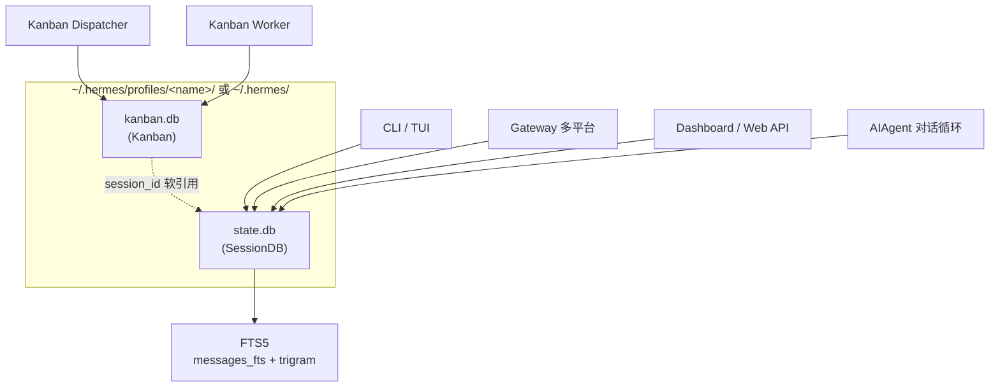

https://github.com/anneheartrecord/claude-code-docs

```mermaid
flowchart TB
    subgraph profile ["~/.hermes/profiles/&lt;name&gt;/ 或 ~/.hermes/"]
        state["state.db<br/>(SessionDB)"]
        kanban["kanban.db<br/>(Kanban)"]
    end

    CLI["CLI / TUI"] --> state
    Gateway["Gateway 多平台"] --> state
    Web["Dashboard / Web API"] --> state
    Agent["AIAgent 对话循环"] --> state

    Dispatcher["Kanban Dispatcher"] --> kanban
    Worker["Kanban Worker"] --> kanban
    kanban -.->|session_id 软引用| state
    state --> FTS["FTS5<br/>messages_fts + trigram"]
```
