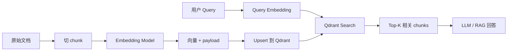
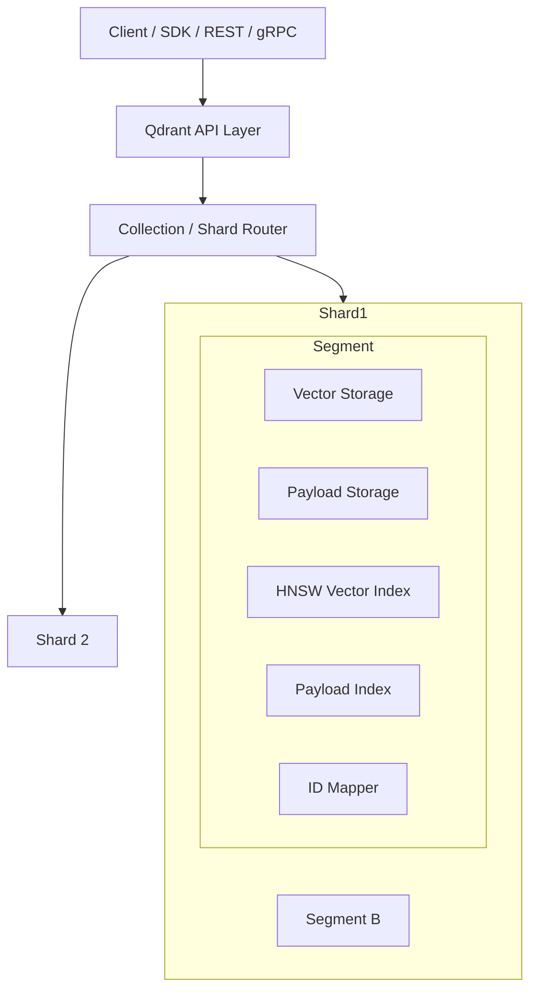
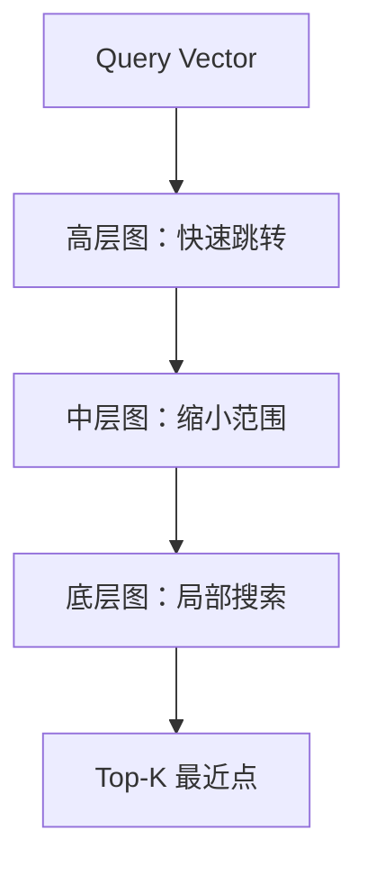
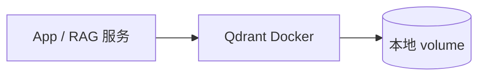
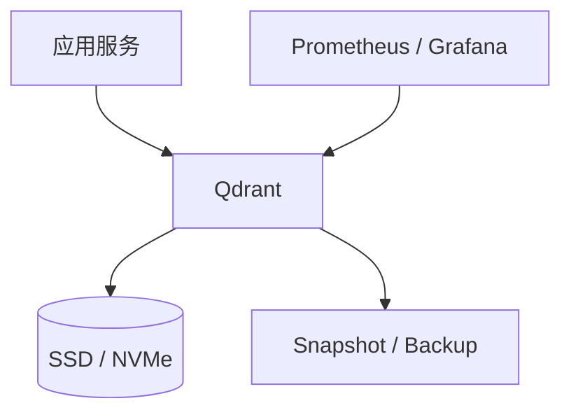
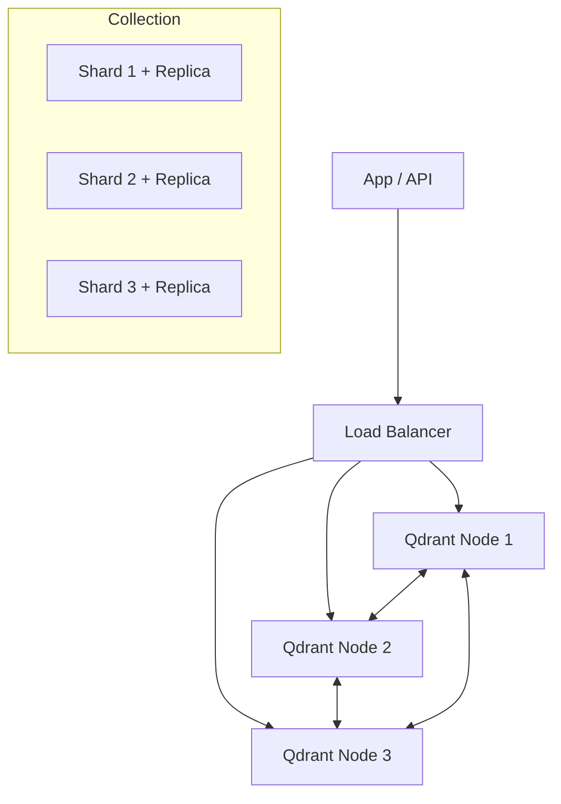
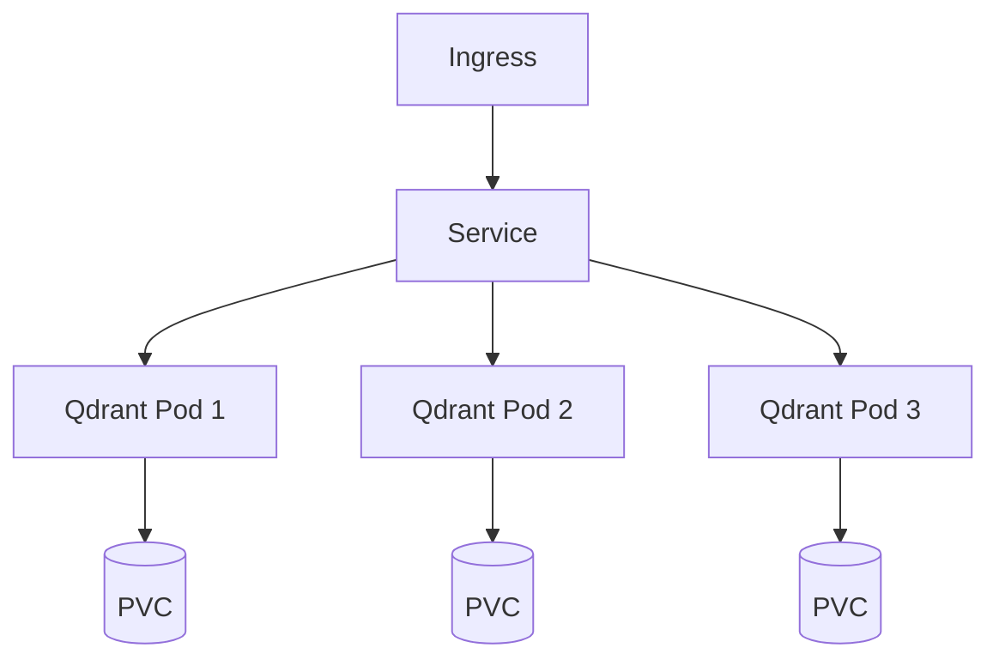

# Qdrant

Qdrant 是一个开源向量数据库，核心用途是做 **向量相似度检索 + 结构化过滤**。典型场景包括 RAG 知识库、语义搜索、推荐、图片/音频检索、Agent Memory 检索等。

一句话：**Embedding 负责把文本/图片变成向量，Qdrant 负责存向量、建索引、按相似度和 payload 条件快速找回来。**

---

## 1. 核心概念

### Point

`Point` 是 Qdrant 里最小的数据单元，类似关系型数据库里的一行记录。

一个 point 通常包含三部分：


| 组成        | 说明                                                       |
| --------- | -------------------------------------------------------- |
| `id`      | 唯一 ID，可以是整数或 UUID                                        |
| `vector`  | 向量，可以是 dense / sparse / multivector，也可以有多个 named vectors |
| `payload` | 结构化元数据，用于过滤、分组、权限控制、租户隔离                                 |


示例：

```json
{
  "id": "doc-001-chunk-003",
  "vector": [0.12, -0.04, 0.91],
  "payload": {
    "tenant_id": "team-a",
    "doc_id": "doc-001",
    "source": "qdrant.md",
    "chunk_index": 3,
    "tags": ["vector-db", "rag"]
  }
}
```

### Vector

向量是语义表示。相似的文本、图片或对象，在向量空间里距离更近。

常见类型：


| 类型            | 说明                        | 场景                            |
| ------------- | ------------------------- | ----------------------------- |
| Dense Vector  | 稠密向量，如 384 / 768 / 1536 维 | 文本语义检索、图片检索                   |
| Sparse Vector | 稀疏向量，类似关键词权重              | BM25 / SPLADE 风格关键词检索         |
| Multivector   | 一个 point 对应多个向量           | ColBERT、多粒度匹配                 |
| Named Vectors | 一个 point 有多个命名向量空间        | 同时支持 title/body/image 等不同检索空间 |


### Payload

`payload` 是 point 的元数据，不参与向量距离计算，但可以参与过滤。

常见用法：

- 多租户隔离：`tenant_id`
- 文档归属：`doc_id`、`source`
- 权限过滤：`user_id`、`visibility`
- 类型过滤：`category`、`tags`
- 时间过滤：`created_at`

注意：经常用于过滤的 payload 字段建议创建 **payload index**，否则过滤会拖慢查询。

### Collection

`Collection` 是 point 的容器，类似数据库里的表。

一个 collection 会定义：

- 向量维度：如 `size=768`
- 距离度量：如 `Cosine` / `Dot` / `Euclid`
- HNSW 索引配置
- 分片、副本、量化、磁盘存储策略

同一个 vector name 下的向量必须维度相同，并使用同一种距离度量。

Qdrant 官方实践中，很多场景不建议每个租户都单独建 collection，而是**一个 collection + payload 字段区分租户**，也就是多租户（Multitenancy）：

```json
{
  "payload": {
    "tenant_id": "customer-a",
    "doc_type": "faq"
  }
}
```

查询时加 filter：

```json
{
  "must": [
    {"key": "tenant_id", "match": {"value": "customer-a"}}
  ]
}
```

---

## 2. Qdrant 能解决什么问题

传统数据库擅长精确匹配：

```sql
WHERE title = 'Qdrant'
```

向量数据库擅长语义相似：

```text
“怎么部署 Qdrant 集群”
≈ “Qdrant production cluster setup”
≈ “向量库高可用部署”
```

Qdrant 的能力组合：


| 能力             | 说明                                 |
| -------------- | ---------------------------------- |
| 向量搜索           | 找到语义最接近的 top-k point               |
| Payload Filter | 在语义搜索同时加业务过滤                       |
| Hybrid Search  | Dense + Sparse 组合，提高召回             |
| 多租户            | 一个 collection 内用 payload 区分 tenant |
| 分片/副本          | 支持横向扩展和高可用                         |
| 量化             | 降低内存占用，提高大规模检索性价比                  |
| On-disk        | 向量或索引落盘，减少 RAM 压力                  |


---

## 3. 基本使用流程

### 使用链路




### Docker 快速启动

```bash
docker run -p 6333:6333 -p 6334:6334 \
  -v "$(pwd)/qdrant_storage:/qdrant/storage" \
  qdrant/qdrant
```

端口：


| 端口     | 协议        | 用途       |
| ------ | --------- | -------- |
| `6333` | HTTP REST | 管理、写入、搜索 |
| `6334` | gRPC      | 高性能客户端调用 |


### Python 客户端示例

```bash
pip install qdrant-client
```

创建 collection：

```python
from qdrant_client import QdrantClient
from qdrant_client.models import Distance, VectorParams

client = QdrantClient(url="http://localhost:6333")

client.create_collection(
    collection_name="knowledge_base",
    vectors_config=VectorParams(
        size=768,
        distance=Distance.COSINE,
    ),
)
```

写入 points：

```python
from qdrant_client.models import PointStruct

client.upsert(
    collection_name="knowledge_base",
    points=[
        PointStruct(
            id="doc-001-0",
            vector=[0.01] * 768,
            payload={
                "tenant_id": "team-a",
                "doc_id": "doc-001",
                "text": "Qdrant 是一个向量数据库...",
            },
        )
    ],
)
```

搜索：

```python
hits = client.search(
    collection_name="knowledge_base",
    query_vector=[0.02] * 768,
    limit=5,
)

for hit in hits:
    print(hit.id, hit.score, hit.payload)
```

带 payload 过滤：

```python
from qdrant_client.models import Filter, FieldCondition, MatchValue

hits = client.search(
    collection_name="knowledge_base",
    query_vector=[0.02] * 768,
    query_filter=Filter(
        must=[
            FieldCondition(
                key="tenant_id",
                match=MatchValue(value="team-a"),
            )
        ]
    ),
    limit=5,
)
```

### 常用 API 动作


| 动作                        | 含义            |
| ------------------------- | ------------- |
| `create_collection`       | 创建 collection |
| `upsert`                  | 插入或更新 point   |
| `search` / `query_points` | 向量搜索          |
| `scroll`                  | 分页扫描 points   |
| `delete`                  | 删除 point      |
| `create_payload_index`    | 为过滤字段建索引      |


---

## 4. 架构

### 逻辑架构




### 存储层级

```text
Collection
  └── Shard
      └── Segment
          ├── Vector Storage
          ├── Payload Storage
          ├── Vector Index (HNSW)
          ├── Payload Index
          └── ID Mapper
```

关键点：

- Collection 可以分成多个 shard。
- 每个 shard 内部由多个 segment 组成。
- Segment 是 Qdrant 的实际存储与索引单元。
- Segment 会在后台被 optimizer 合并、重建索引、压缩。

### Segment 的意义

Qdrant 不会把所有数据都塞进一个巨大索引，而是分成多个 segment。


| Segment 多       | Segment 少 |
| --------------- | --------- |
| 写入和索引构建更快       | 查询吞吐更好    |
| 查询时要扫更多 segment | 重建和优化更慢   |
| 适合写入频繁阶段        | 适合稳定查询阶段  |


后台 optimizer 会在写入和查询之间做平衡。

---

## 5. 检索原理

### 距离度量


| 距离     | 含义             | 常见场景               |
| ------ | -------------- | ------------------ |
| Cosine | 余弦相似度，关注方向     | 文本 embedding 最常见   |
| Dot    | 点积，适合已归一化或模型要求 | 推荐、部分 embedding 模型 |
| Euclid | 欧氏距离，关注几何距离    | 特定向量空间             |


选择原则：**跟 embedding 模型训练时推荐的距离保持一致**。

### HNSW 索引

Qdrant 主要使用 HNSW（Hierarchical Navigable Small World）做近似最近邻搜索。

直觉：

- 把向量组织成一张多层小世界图。
- 高层负责快速跳到目标附近。
- 低层做局部精细搜索。
- 不必全量扫描所有向量。




常见参数：


| 参数                   | 影响                  |
| -------------------- | ------------------- |
| `m`                  | 每个节点连接数，越大召回越高、内存越大 |
| `ef_construct`       | 建索引质量，越大索引越好、构建越慢   |
| `hnsw_ef` / query ef | 查询时搜索范围，越大召回越高、延迟越高 |


### Filterable HNSW

普通向量检索 + 过滤有两种低效做法：

- 先向量检索再过滤：可能 top-k 都被过滤掉。
- 先过滤再向量检索：候选集太大时慢。

Qdrant 的 payload index 会扩展 HNSW 图，让过滤条件能参与图遍历，适合：

- 多租户：`tenant_id`
- 权限过滤：`user_id`
- 类型过滤：`category`

因此，经常过滤的字段要建 payload index。

---

## 6. 性能与容量设计

### Payload Index

为常用过滤字段建索引：

```python
from qdrant_client.models import PayloadSchemaType

client.create_payload_index(
    collection_name="knowledge_base",
    field_name="tenant_id",
    field_schema=PayloadSchemaType.KEYWORD,
)
```

建议建索引的字段：

- `tenant_id`
- `doc_id`
- `category`
- `tags`
- `created_at`
- 权限相关字段

### On-disk Storage

数据规模变大时，可以把向量或 payload 放到磁盘，降低内存压力。

```json
{
  "vectors": {
    "size": 768,
    "distance": "Cosine",
    "on_disk": true
  },
  "hnsw_config": {
    "on_disk": true
  },
  "on_disk_payload": true
}
```

取舍：


| 方案              | 优点          | 缺点          |
| --------------- | ----------- | ----------- |
| In-memory       | 查询快         | RAM 成本高     |
| On-disk vector  | RAM 压力小     | 依赖 SSD，延迟更高 |
| On-disk payload | 适合大 payload | 过滤字段必须建索引   |


### Quantization

量化是把 float 向量压缩成更小的数据类型，降低内存和磁盘占用。


| 类型                   | 说明            |
| -------------------- | ------------- |
| Scalar Quantization  | 常见 int8 压缩    |
| Binary Quantization  | 1-bit 压缩，占用更小 |
| Product Quantization | 更高压缩比，适合超大规模  |


典型用途：

- 大规模向量集合
- 内存成本敏感
- 可接受少量召回下降

### 写入建议

- 使用 batch upsert，避免一条一条写。
- 大规模导入时先批量导入，再让 optimizer 建索引。
- payload 大字段不要都塞进 Qdrant；原文可放对象存储，只存摘要/路径。
- point id 要稳定，方便重跑和幂等更新。

---

## 7. 部署架构

### 单机开发




适合：

- 本地开发
- 小型知识库
- POC / Demo

Docker Compose 示例：

```yaml
services:
  qdrant:
    image: qdrant/qdrant:latest
    ports:
      - "6333:6333"
      - "6334:6334"
    volumes:
      - ./qdrant_storage:/qdrant/storage
    restart: unless-stopped
```

### 生产单机




注意：

- 使用独立 SSD/NVMe。
- 挂载持久化 volume。
- 调高 file descriptor limit。
- 定期做 snapshot。
- 对关键 filter 字段建 payload index。

### 集群部署




核心概念：


| 概念                 | 说明             |
| ------------------ | -------------- |
| Shard              | 水平切分数据，提高容量和吞吐 |
| Replica            | 副本，提高可用性       |
| Replication Factor | 每个 shard 有几份副本 |
| Consensus          | 集群元数据一致性       |


生产建议：

- 关键业务副本数至少 2。
- 根据数据量和节点数规划 shard 数。
- 小集群不要盲目开太多 shard，否则每个节点管理过多 shard 会影响吞吐。
- 读多写少场景适合更多副本。
- 写入高峰要关注 optimizer 和 segment merge 压力。

### Kubernetes 部署




关注点：

- StatefulSet 而不是 Deployment。
- 每个 Pod 独立 PVC。
- 存储类型优先 SSD。
- 配置 readiness/liveness probe。
- 配置资源 requests/limits。
- 单独规划 snapshot/backup。

---

## 8. RAG 中怎么建模

### 推荐 payload 结构

```json
{
  "tenant_id": "team-a",
  "doc_id": "handbook-001",
  "chunk_id": "handbook-001-0003",
  "source": "handbook.md",
  "title": "员工手册",
  "section": "报销流程",
  "chunk_index": 3,
  "text": "报销需要提交发票、审批单...",
  "created_at": "2026-08-04T00:00:00Z"
}
```

### Collection 设计


| 方案                          | 适合场景              |
| --------------------------- | ----------------- |
| 一个业务一个 collection           | 向量模型、距离、生命周期差异很大  |
| 一个 collection + `tenant_id` | 多租户共享同一模型和维度      |
| Named vectors               | 同一 point 需要多种向量空间 |


### 多租户过滤

```python
query_filter=Filter(
    must=[
        FieldCondition(key="tenant_id", match=MatchValue(value="team-a")),
        FieldCondition(key="visibility", match=MatchValue(value="internal")),
    ]
)
```

建议：

- `tenant_id` 必须建 payload index。
- 权限字段也要建 index。
- 不要只靠应用层过滤，否则可能召回不稳定且有越权风险。

---

## 9. 常见坑


| 问题              | 原因                            | 建议                                  |
| --------------- | ----------------------------- | ----------------------------------- |
| 搜不到相似内容         | embedding 模型不合适 / chunk 太大或太小 | 先调 chunk 和 embedding，再调 Qdrant      |
| 过滤后召回很差         | 先搜后过滤导致候选不足                   | 建 payload index，调大 `limit` / `ef`   |
| 内存占用过高          | 向量全在 RAM，payload 太大           | on-disk + quantization + payload 外置 |
| 写入慢             | 单条写入、optimizer 压力大            | batch upsert，错峰建索引                  |
| 多租户混数据          | 没加 `tenant_id` filter         | 查询层强制注入 filter                      |
| 分 collection 太多 | 每租户一 collection 管理成本高         | 优先一个 collection + payload 多租户       |
| 距离度量不对          | 与 embedding 模型不匹配             | 按模型文档选择 Cosine/Dot/Euclid           |


---

## 10. 一句话总结

Qdrant 的核心模型是：

```text
Collection → Shard → Segment → Point(id + vector + payload)
```

它的核心能力是：

```text
HNSW 近似向量搜索 + Payload Filter + Payload Index + 分片副本 + On-disk/Quantization
```

用于 RAG 时，最重要的工程原则是：

```text
稳定 point id
合理 chunk
payload 设计好 tenant/doc/权限字段
常用过滤字段建 index
向量模型、维度、距离度量保持一致
```

---

## 参考

- [Qdrant Overview](https://qdrant.tech/documentation/overview/)
- [Qdrant Points](https://qdrant.tech/documentation/concepts/points/)
- [Qdrant Storage](https://qdrant.tech/documentation/concepts/storage/)
- [Qdrant 1.16: Tiered Multitenancy & Disk-Efficient Vector Search](https://qdrant.tech/blog/qdrant-1.16.x/)


### 第1层：Collection（集合）—— 逻辑数据库表

这是你与应用交互的最高层级，相当于关系型数据库中的**“数据表”**。

- **作用**：定义全局规则。同一个 Collection 内的所有向量必须具有**相同的维度（Dimension）**和使用**相同的距离度量（Distance Metric）**（如余弦相似度）。
- **特性**：它本身不存储数据，仅作为逻辑容器，管理其下所有分片的拓扑结构和配置。

---

### 🗄️ 第2层：Shard（分片）—— 分布式物理单元

当 Collection 数据量巨大或需要高吞吐量时，Qdrant 会将 Collection **水平切分**为多个 Shard（分片）。这是实现**分布式扩展**的核心机制。

- **作用**：承载实际的数据读写。每个 Shard 都是一个完全独立的、自包含的物理存储单元（类似于 Elasticsearch 的分片）。
- **分布**：Qdrant 通过一致性哈希，将不同的 Shard 分配到集群的不同节点（Node）上。
- **高可用**：你可以为 Shard 设置**副本（Replica）**，即把同一个 Shard 复制到多个节点上。当主节点宕机时，副本可立即接管（主从架构）。
- **注意**：一个 Shard 只能归属于一个节点，但它内部的 Segment 都是在本地磁盘上管理的。

---

### 📦 第3层：Segment（段）—— 不可变的索引与数据文件

这是 **Qdrant 存储引擎最核心的设计**。每个 Shard 在物理磁盘上并不是一个巨大的单文件，而是由多个 **Segment（段）** 组成的。

- **本质**：Segment 是磁盘/内存中的**物理文件集合**（包含向量数据、Payload 数据、HNSW 索引结构等）。
- **不可变性（Immutable）**：一旦 Segment 被写入并封存（Sealed），它就**永远不再修改**。这是 Qdrant 高性能的基石（避免并发锁竞争）。
- **写入流程（LSM Tree 思想）**：
  1. 新加入的 Point 会先写入内存中的一个 **"Active" Segment**（可变的，用于缓冲）。
  2. 当这个 Segment 的大小或向量数量达到阈值（如 `max_segment_size`），它会被“封存”并刷写到磁盘。
  3. 后台的 **Optimizer（优化器）** 会定期将多个小的、旧的 Segment **合并（Merge）** 成一个大的 Segment，并删除已被逻辑删除的 Point，从而回收磁盘空间并减少查询时的文件句柄数。
- **索引粒度**：每个 Segment 内部都包含独立的 **HNSW 向量索引** 和 **Payload 索引**。查询时，Qdrant 会并行搜索所有 Segment，然后合并结果。

---

### 📄 第4层：Point（点）—— 最小数据原子

这就是你代码中实际插入和查询的最小单元，对应档案柜里的一张具体档案页。

- **结构**：严格由三部分组成：
  1. **ID（唯一标识符）**：`int64` 或 `UUID`，用于精确增删改查。
  2. **Vector（向量）**：浮点数列表，是相似度计算的数学依据。
  3. **Payload（负载）**：JSON 格式的元数据（如 `{"price": 100, "brand": "Nike"}`），用于**预过滤**（在向量搜索前先根据条件筛选出一部分 Point）或**返回展示**。
- **存储位置**：一个 Point 在物理上被“肢解”存储在不同的文件中——向量数据存储在向量文件里，Payload 存储在 Payload 文件中，但它们通过内部指针关联，逻辑上组成一个完整的 Point。

---

### ⚙️ 数据流动（写入与查询）全链路

为了加深理解，看看数据是如何流转的：

1. **写入（Upsert）**：  
`API 接收 Point` → 路由到对应的 `Shard` → 追加到该 Shard 的 `Active Segment`（内存） → 后台异步刷盘并生成不可变 Segment。
2. **查询（Search）**：  
`API 接收带过滤条件的查询向量` → 路由到 `Shard` → **并行遍历**该 Shard 下**所有** `Segment`（利用各 Segment 内部的 HNSW 索引快速找到 Top K，并结合 Payload 索引过滤） → 各 Segment 返回局部结果 → **合并排序** → 返回最终 Top K 给客户端。

---

### 📌 总结：为何要这样设计？


| 层级             | 设计目的       | 关键特性                          |
| -------------- | ---------- | ----------------------------- |
| **Collection** | 业务逻辑隔离     | 统一维度与度量，屏蔽底层物理细节              |
| **Shard**      | 横向扩展与高可用   | 分布式路由，副本容灾                    |
| **Segment**    | 极致的写入/查询性能 | **不可变性**（无锁读）、后台合并（消除碎片）、独立索引 |
| **Point**      | 精确的数据操作    | 向量(语义) + Payload(元数据) 分离，支持过滤 |


> **一句话理解**：**Collection** 是逻辑“大表”，按**Shard**分布在服务器上；每个**Shard**内部由无数个只读的**Segment**文件组成；每个**Segment** 内部存放着无数个包含 `id + vector + payload` 的 **Point**。理解 Segment 的不可变性，是理解 Qdrant 读写性能优越性的钥匙。


### HNSW：近似向量搜索的引擎


